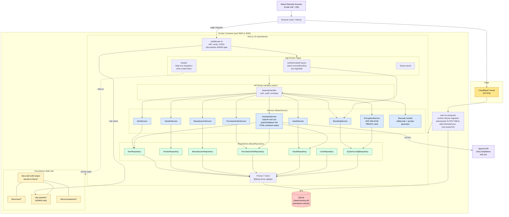
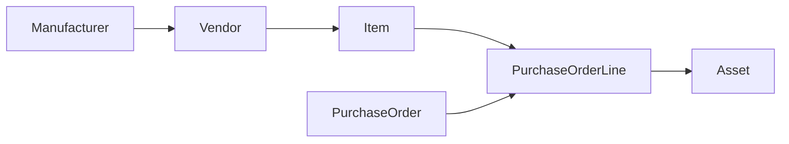

```mermaid
flowchart TB
    Browser["Browser (User / Admin)"]
    Scanner["Netum Barcode Scanner<br/>(Code 128 + QR)"]

    subgraph Edge["Edge"]
        Tunnel["Cloudflared Tunnel<br/>(HTTPS)"]
    end

    subgraph Docker["Docker Container (port 5600 to 3000)"]
        Start["start.sh entrypoint<br/>runtime SQLite migration<br/>(idempotent ALTER TABLE,<br/>adds Manufacturer, User.avatarUrl)"]

        subgraph Next["Next.js 15 (standalone)"]
            MW["middleware.ts<br/>JWT verify, CORS,<br/>/docs/admin ADMIN gate"]

            subgraph Pages["App Router Pages"]
                Auth["(authenticated) layout<br/>injects serverBranding<br/>into AppShell"]
                Header["Header<br/>Help icon dropdown<br/>(role-routed links)"]
                Setup["Setup wizard"]
            end

            subgraph API["API Route Handlers (/api/*)"]
                BaseApi["BaseApiHandler<br/>auth, audit, envelope"]
            end

            subgraph Services["Services (BaseService)"]
                ItemSvc["ItemService"]
                VendorSvc["VendorService"]
                MfgSvc["ManufacturerService"]
                POSvc["PurchaseOrderService"]
                AssetSvc["AssetService"]
                BrandSvc["BrandingService"]
                VaultSvc["EncryptionService<br/>AES-256-GCM<br/>PBKDF2 vault"]
                AssistSvc["AssistantService<br/>OpenAI tool use<br/>queryDatabase tool<br/>HTML sanitized output"]
                BarcodeSvc["Barcode module<br/>JsBarcode + qrcode-generator"]
            end

            subgraph Repos["Repositories (BaseRepository)"]
                ItemRepo["ItemRepository"]
                VendorRepo["VendorRepository"]
                MfgRepo["ManufacturerRepository"]
                PORepo["PurchaseOrderRepository"]
                AssetRepo["AssetRepository"]
                UserRepo["UserRepository"]
                CfgRepo["SystemConfigRepository"]
            end

            Prisma["Prisma 7 Client<br/>@libsql driver adapter"]
        end

        subgraph Docs["Docusaurus static site"]
            DocsBuild["docs-site build output<br/>served at /docs/*"]
            UserDocs["/docs/user/*"]
            AdminDocs["/docs/admin/*<br/>(ADMIN only)"]
            CompareDocs["/docs/comparison/*"]
        end

        SQLite[("SQLite<br/>/data/inventory.db<br/>(persistent volume)")]
    end

    OpenAI["OpenAI API<br/>chat.completions<br/>tool use"]

    Browser --> Tunnel
    Scanner --> Browser
    Tunnel --> Start
    Start --> Next
    Start --> SQLite

    Browser -->|page requests| MW
    MW --> Pages
    MW -->|role check| AdminDocs
    Pages --> API
    Header -.->|links to| Docs

    API --> BaseApi
    BaseApi --> ItemSvc
    BaseApi --> VendorSvc
    BaseApi --> MfgSvc
    BaseApi --> POSvc
    BaseApi --> AssetSvc
    BaseApi --> BrandSvc
    BaseApi --> VaultSvc
    BaseApi --> AssistSvc
    BaseApi --> BarcodeSvc

    Auth --> BrandSvc

    ItemSvc --> ItemRepo
    VendorSvc --> VendorRepo
    MfgSvc --> MfgRepo
    POSvc --> PORepo
    AssetSvc --> AssetRepo
    BrandSvc --> CfgRepo
    VaultSvc --> CfgRepo
    AssistSvc --> ItemRepo
    AssistSvc --> AssetRepo
    AssistSvc --> PORepo

    ItemRepo --> Prisma
    VendorRepo --> Prisma
    MfgRepo --> Prisma
    PORepo --> Prisma
    AssetRepo --> Prisma
    UserRepo --> Prisma
    CfgRepo --> Prisma

    Prisma --> SQLite

    AssistSvc -->|HTTPS| OpenAI

    DocsBuild --- UserDocs
    DocsBuild --- AdminDocs
    DocsBuild --- CompareDocs
    Next -.->|serves static| Docs

    classDef edge fill:#fde68a,stroke:#b45309,color:#111
    classDef svc fill:#dbeafe,stroke:#1d4ed8,color:#111
    classDef repo fill:#dcfce7,stroke:#15803d,color:#111
    classDef data fill:#fecaca,stroke:#b91c1c,color:#111
    classDef ext fill:#ede9fe,stroke:#6d28d9,color:#111
    classDef docs fill:#fef3c7,stroke:#a16207,color:#111

    class Tunnel edge
    class ItemSvc,VendorSvc,MfgSvc,POSvc,AssetSvc,BrandSvc,VaultSvc,AssistSvc,BarcodeSvc svc
    class ItemRepo,VendorRepo,MfgRepo,PORepo,AssetRepo,UserRepo,CfgRepo repo
    class SQLite data
    class OpenAI,Scanner ext
    class DocsBuild,UserDocs,AdminDocs,CompareDocs docs
```

## Traceability chain

```mermaid
flowchart LR
    M[Manufacturer] --> V[Vendor]
    V --> I[Item]
    I --> POL[PurchaseOrderLine]
    PO[PurchaseOrder] --> POL
    POL --> A[Asset]
```
