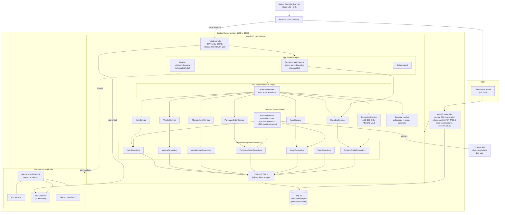
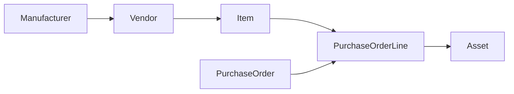

# System Architecture

Inventory Management is a single container, single tenant Next.js 15 application backed by SQLite. It is designed to run in one Docker container, write to one mounted volume, and speak to the outside world over a single HTTPS port fronted by a reverse proxy or Cloudflared tunnel.

### Traceability chain

## Runtime stack

- **Next.js 15 App Router** with the `standalone` output mode. Server components handle rendering, route handlers handle APIs, middleware handles auth and CORS. The production build is copied into the runner image along with a trimmed `node_modules` tree; see `Dockerfile` lines 38 to 45.
- **Prisma 7** with the `@libsql` driver adapter pointed at a local SQLite file. The schema lives in `prisma/schema.prisma`; the generated client lives under `node_modules/.prisma/client` and is baked into the image at build time.
- **NextAuth (credentials provider, JWT strategy)**. Configured in `src/lib/auth-options.ts` (with helpers in `src/lib/auth.ts`). Sessions are JWTs, not database rows; there is no Session table. The `tenantId`, `role`, and `userId` are encoded into the token at sign in.
- **OpenAI SDK** powers the AI assistant and AI assisted data source mapping. The key is read from the encrypted vault at request time, never from `process.env` after setup.
- **ShadCN + Radix UI** on the front end. Branding (logo, primary color, theme mode) is injected server side as inline CSS variables so there is no flash of unstyled content on first paint.

## OOP base layer

The codebase enforces a strict OOP discipline. Every domain has three layers:

- `BaseRepository<T>` in `src/lib/base/BaseRepository.ts`. Wraps Prisma for a single model and holds the tenant scoping. Subclasses like `ItemRepository`, `AssetRepository`, `PurchaseOrderRepository` only add model specific queries.
- `BaseService` in `src/lib/base/BaseService.ts`. Business logic lives here. Services own one or more repositories and never touch Prisma directly.
- `BaseApiHandler` in `src/lib/base/BaseApiHandler.ts`. Handles request parsing, auth checks, error envelope formatting, and audit log writes. Route files under `src/app/api/**/route.ts` instantiate the handler and delegate.

New features should always follow this inheritance chain. Skipping layers (for example, a route file that calls Prisma directly) is a bug.

## AI assistant

`AssistantService` in `src/lib/assistant/` wraps the OpenAI chat completions API with tool use. The assistant is given a tool schema that maps to read only repository calls, so it can answer questions like "what's my stock of SKU FOO-123" by actually running a query rather than hallucinating. Conversations persist in `ChatConversation` and `ChatMessage` (see `prisma/schema.prisma`), scoped by `tenantId` and `userId`.

## Server side branding

`src/lib/branding.ts` defines `TenantBranding`, `parseBranding()`, and `mergeBrandingIntoSettings()`. The root layout reads the current tenant's settings JSON on every request, parses the branding block, and inlines the primary colors and theme mode into the HTML as CSS custom properties. This eliminates the flash of default colors that a client side hook would cause. Logo and favicon URLs are likewise rendered into the initial HTML so they appear on first paint.

## Vault

The AES-256-GCM encryption service in `src/lib/encryption/EncryptionService.ts` is the only place in the codebase that performs crypto primitives. Key derivation uses PBKDF2-SHA512 with 600,000 iterations and a 16 byte random salt stored on `SetupState`. The derived key is held in process memory after vault unlock and used to encrypt or decrypt every `SystemConfig` row marked `isSecret = true`.

If `VAULT_KEY` is present in the environment at container start, the app unlocks the vault automatically using that key (derived separately and stored by the operator). If not, the first admin to sign in after a restart is prompted to enter the setup passphrase, which re-derives the in memory key.

## Data flow: user logs in and fetches items

This is the canonical request path. Follow it to understand how a feature is wired.

1. Browser posts credentials to `/api/auth/callback/credentials` (NextAuth). Handler in `src/lib/auth-options.ts` calls `UserRepository.findByEmail()`, verifies the bcrypt hash, and issues a JWT containing `userId`, `tenantId`, and `role`.
2. Browser navigates to `/items`. The App Router hits `src/middleware.ts`, which checks for a valid JWT and applies CORS headers from the `security.corsOrigins` config.
3. The page server component calls an API route under `src/app/api/items/route.ts`.
4. The route handler extends `BaseApiHandler`. It reads the session (`getServerSession`), extracts `tenantId`, then calls `new ItemService().list({ tenantId })`.
5. `ItemService` (extends `BaseService`) applies any business rules (filtering inactive items, joining category counts) and calls `new ItemRepository().findMany({ where: { tenantId } })`.
6. `ItemRepository` (extends `BaseRepository`) forwards to Prisma, which talks to SQLite via the libsql adapter.
7. Rows come back up the stack. `BaseApiHandler` wraps the result in `{ success: true, data }` and also writes an `AuditLog` row if the route is configured to audit.
8. React renders the items table.

Every tenant scoped query in the application follows this same structure. If you see a new route that skips `BaseApiHandler` or talks to Prisma directly, rewrite it.

## File layout cheat sheet

- `src/app/(authenticated)/` server rendered authenticated pages
- `src/app/api/` route handlers
- `src/app/setup/` first run wizard
- `src/lib/base/` OOP base classes
- `src/lib/inventory/`, `src/lib/procurement/`, `src/lib/receiving/`, `src/lib/vendors/` domain services and repositories
- `src/lib/assistant/` OpenAI tool use logic
- `src/lib/encryption/` AES-256-GCM vault
- `src/lib/auth-options.ts`, `src/lib/auth.ts` NextAuth wiring
- `src/lib/branding.ts` tenant branding parsing and merging
- `src/middleware.ts` JWT verification and CORS
- `prisma/schema.prisma` data model
- `docker-init/start.sh` container entrypoint and runtime migrations
