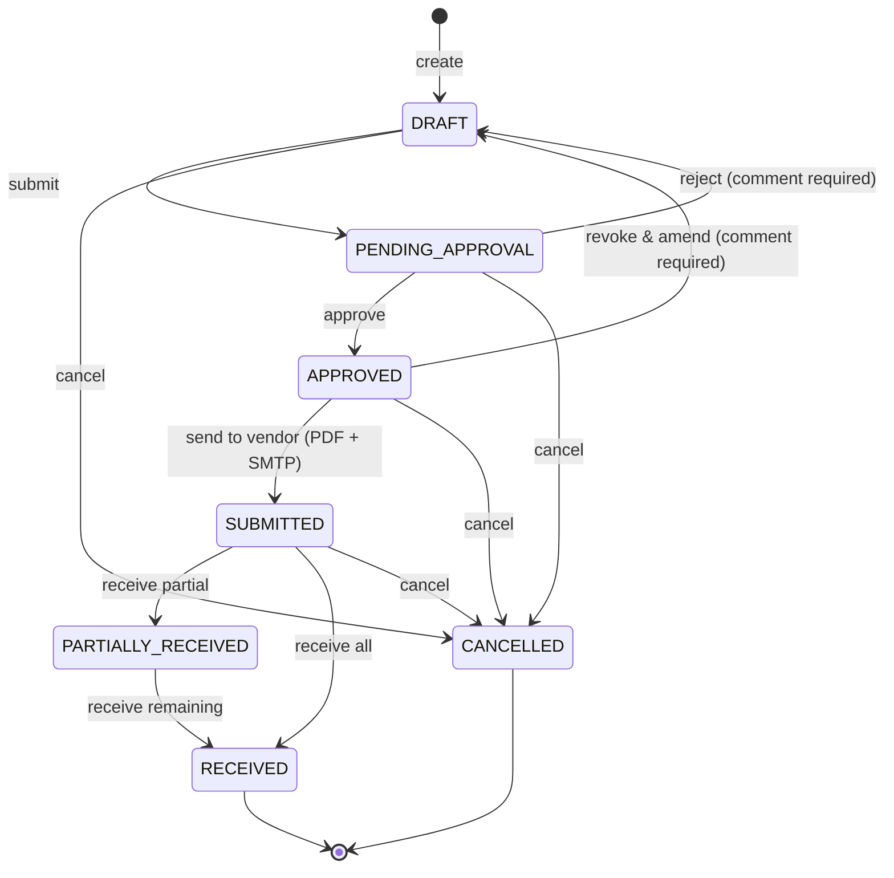

# Procurement Workflow

This document describes how a purchase order (PO) moves through Shane Inventory from the moment someone clicks "New Purchase Order" until the day the shipment lands on the receiving dock. It covers the roles involved, the state machine, the notification fan-out, the audit trail vocabulary, and the "Send to Vendor" email step.

The authoritative implementation lives in `src/lib/services/purchase-order-service.ts` (transitions, guards, audit writes) and the route handlers under `src/app/api/procurement/orders/`. Role definitions live in `src/lib/types.ts` and `src/lib/roles.ts`. The notification fan-out lives in `src/lib/services/notification-service.ts`.

## Roles and segregation of duties

Shane Inventory enforces a strict split between the person who drafts a PO and the person who approves it. Prior to the rework, the `MANAGER` role could both create and approve, which violated basic segregation of duties (the same user could requisition supplies, self-approve, and send the email to the vendor). The rework introduces a dedicated approver role and removes the approval right from `MANAGER`.

| Capability | ADMIN | PURCHASING_MANAGER | MANAGER | WAREHOUSE_STAFF |
|---|---|---|---|---|
| Create a draft PO | yes | yes | yes | no |
| Edit a draft PO | yes | yes | yes | no |
| Submit a draft for approval | yes | yes | yes | no |
| Approve a PENDING_APPROVAL PO | yes | yes | no | no |
| Reject a PENDING_APPROVAL PO (with comment) | yes | yes | no | no |
| Revoke & Amend an APPROVED PO (with comment) | yes | yes | no | no |
| Send an APPROVED PO to the vendor | yes | yes | yes | no |
| Receive a shipment | yes | yes | yes | yes |
| Cancel a PO | yes | yes | yes | no |
| Manage vendors and catalog | yes | yes | yes | no |
| Receive approval-request notifications | yes | yes | no | no |

Rules of thumb:

- `MANAGER` is now purely a requisition role plus vendor and catalog management. A manager can draft every PO in the system but cannot sign off on any of them, not even their own.
- `PURCHASING_MANAGER` is the new approver role. It inherits every manager capability and adds approve, reject, and revoke. It also appears in the distribution list for every submit event.
- `ADMIN` retains the full superset, as always.
- `WAREHOUSE_STAFF` is still a receive-only role. Warehouse users cannot create or edit POs at all.

The permission key used by the service layer is `procurement.approve`. After the rework, only `ADMIN` and `PURCHASING_MANAGER` evaluate to `true` on that key in `src/lib/roles.ts`. Any code path that gates on it, including the Approve button on the PO detail page, the three approval endpoints, and the notification fan-out, consults the same constant.

## State machine

Purchase orders move through seven possible states. `PurchaseOrderService` is the only place state transitions are allowed; every route handler funnels through a service method that validates the current state, the caller's permission, and the transition target before writing.

Notes on the diagram:

- The only way to get from `APPROVED` back to an editable state is Revoke & Amend, which sends the PO to `DRAFT` with a mandatory comment. There is no silent un-approve.
- Reject also lands on `DRAFT`, not on a dedicated `REJECTED` state. The rejection reason lives in the audit log and in the notification sent to the requester, not in the PO state itself. This keeps the state machine small and lets the requester fix the PO in place instead of cloning it.
- Cancel is terminal. A cancelled PO cannot be reopened. If you change your mind, clone it into a new draft.

## Edit rules per state

Which fields are editable depends entirely on the current state. The UI enforces this on the detail page; the service layer enforces it a second time on every write.

| State | Header (vendor, dates, notes) | Line items | Status action allowed |
|---|---|---|---|
| DRAFT | editable | editable (add, remove, change qty/price) | Submit, Cancel |
| PENDING_APPROVAL | read only | read only | Approve, Reject, Cancel |
| APPROVED | read only | read only | Send to Vendor, Revoke & Amend, Cancel |
| SUBMITTED | read only | read only | Receive, Cancel |
| PARTIALLY_RECEIVED | read only | read only | Receive remaining, Cancel |
| RECEIVED | read only | read only | none (terminal) |
| CANCELLED | read only | read only | none (terminal) |

If a manager needs to fix a typo on an APPROVED PO, the workflow is:

1. Manager opens the PO, sees no edit controls.
2. Manager asks a purchasing manager (or admin) to Revoke & Amend, leaving a comment that explains what needs to change.
3. The PO snaps back to DRAFT, the requester is notified, the requester edits, re-submits.

This is deliberately slower than "just let managers edit approved POs" because the whole point of the approval step is to lock the document once it is approved. A silent post-approval edit would defeat the control.

## Notification matrix

Every state transition that matters writes to the `Notification` table and, if the matching email category is enabled, also sends an SMTP email. The in-app notification always fires regardless of the email toggle; see `admin/settings-notifications` for the email side.

| Trigger | Recipients | In-app notification | Email category |
|---|---|---|---|
| `DRAFT` to `PENDING_APPROVAL` (submit) | every active `ADMIN` and `PURCHASING_MANAGER` in the tenant | yes, one per recipient, link opens the PO | Approval Requests |
| `PENDING_APPROVAL` to `APPROVED` (approve) | original requester (`PurchaseOrder.orderedBy`) | yes | Order Status Changes |
| `PENDING_APPROVAL` to `DRAFT` (reject) | original requester | yes, body includes the rejection comment | Order Status Changes |
| `APPROVED` to `DRAFT` (revoke & amend) | original requester | yes, body includes the revocation comment | Order Status Changes |
| `APPROVED` to `SUBMITTED` (send to vendor) | original requester plus vendor (via email) | yes for requester | Order Status Changes |
| `SUBMITTED` to `RECEIVED` or `PARTIALLY_RECEIVED` | original requester | yes | Order Status Changes |
| any state to `CANCELLED` | original requester | yes | Order Status Changes |

Important:

- The approver fan-out on submit was previously documented but not actually wired up. It is now. When `PurchaseOrderService.submitOrder()` commits the state change, it performs a single `SELECT` for `User` rows in the tenant with `isActive = true` and `role IN ('ADMIN', 'PURCHASING_MANAGER')`, then inserts one `Notification` row per user inside the same transaction that moved the PO. No approver is ever skipped.
- The "notify the requester" events also used to be silent. They are now active for approve, reject, and revoke so the person who submitted the PO finds out what happened without having to poll the list page.
- Each notification includes a `link` pointing at `/procurement/orders/{id}`. Clicking it in the bell dropdown jumps straight to the detail page.

## Send to Vendor

`Send to Vendor` is the action that actually transmits the PO to the outside world. It is the only path that transitions from `APPROVED` to `SUBMITTED`.

What happens when a user clicks it on an APPROVED PO:

1. The service renders the PO to a PDF using the same generator used by the manual "Download PDF" button. The PDF carries the tenant's branding (logo, colors) pulled from `Tenant.settings`.
2. The service looks up the `Vendor` row by `PurchaseOrder.vendorId` and reads two fields:
   - `Vendor.email` populates the `To:` header on the outbound message. This is the mailbox the PDF is delivered to.
   - `Vendor.contactName` populates the greeting line in the email body ("Dear Jane,"). If `contactName` is unset, the greeting falls back to the vendor's company name ("Dear Acme Industries,").
3. The service calls the SMTP transport configured under `/settings/integrations`, attaching the generated PDF. Delivery is synchronous; a send failure aborts the transition and leaves the PO in `APPROVED` so the operator can retry.
4. On success, the service transitions the PO to `SUBMITTED`, writes an audit row with action `SUBMIT_TO_VENDOR`, and notifies the requester.

If SMTP is not configured, the Send to Vendor button still appears but the action fails with a clear error toast. Configure SMTP first (see `admin/settings-integrations`).

### Why "Submit to Vendor" was removed

Before the rework there were two buttons on an APPROVED PO: "Submit to Vendor" and "Send to Vendor". Only one of them actually mailed the PDF.

- "Submit to Vendor" was a legacy holdover. It silently flipped the status from `APPROVED` to `SUBMITTED` without touching SMTP, without generating a PDF, and without telling the vendor anything. Nobody remembered exactly why it existed. It was probably a placeholder from a much earlier iteration where the email step was manual.
- "Send to Vendor" was the real button. It generated the PDF, sent the email, and then flipped the state.

Having both was a footgun. A careless operator could click "Submit to Vendor" and mark the PO as sent even though the vendor never received anything. The rework deletes "Submit to Vendor" entirely. The only way to leave the `APPROVED` state towards `SUBMITTED` is now the genuine email path.

If you have a legacy playbook that mentions clicking "Submit to Vendor," update it. That button no longer exists in the UI and its backing service method has been removed.

## Audit trail vocabulary

Every transition writes a row to `AuditLog`. The columns:

- `userId`: the user who took the action.
- `entity`: `PurchaseOrder` for PO events, `User` for authentication events.
- `entityId`: the PO id (or user id for auth events).
- `action`: one of a small fixed set (see below).
- `details`: JSON blob with the before/after state, the comment for reject and revoke, the vendor email for send events, and any other relevant context.
- `ipAddress`: captured from the request.
- `createdAt`: timestamp.

The action vocabulary now in use:

| Action | Written by | Details payload includes |
|---|---|---|
| `CREATE` | PO creation | vendor id, initial line count |
| `SUBMIT` | DRAFT to PENDING_APPROVAL | requester id, line count |
| `APPROVE` | PENDING_APPROVAL to APPROVED | approver id |
| `REJECT` | PENDING_APPROVAL to DRAFT | approver id, `comment` (required) |
| `REVOKE_APPROVAL` | APPROVED to DRAFT | approver id, `comment` (required) |
| `SUBMIT_TO_VENDOR` | APPROVED to SUBMITTED | vendor email, contact name used in greeting |
| `RECEIVE` | SUBMITTED or PARTIALLY_RECEIVED to PARTIALLY_RECEIVED or RECEIVED | line ids, received quantities |
| `CANCEL` | any state to CANCELLED | previous state |
| `LOGIN` | successful sign-in | session id |
| `LOGOUT` | sign-out | session id |
| `LOGIN_FAILED` | bad credentials or locked account | attempted email, failure reason |

This vocabulary is the canonical list. If you are writing an integration that inspects the audit log, match exactly these strings; there are no synonyms or legacy aliases.

The comment captured on Reject and on Revoke & Amend lives in `details.comment`. It is also copied into the notification body sent to the requester so the requester sees the reason without having to open the audit log viewer.

## API endpoints

The procurement state machine is exposed through these routes under `/api/procurement/orders/`:

- `POST /api/procurement/orders`: create a draft. Any role with `procurement.create`.
- `PUT /api/procurement/orders/[id]`: edit a draft. Any role with `procurement.edit`. Rejects the write if the PO is not in DRAFT.
- `POST /api/procurement/orders/[id]/submit`: DRAFT to PENDING_APPROVAL. Fans out notifications to approvers.
- `POST /api/procurement/orders/[id]/approve`: PENDING_APPROVAL to APPROVED. Restricted to `ADMIN` and `PURCHASING_MANAGER`.
- `POST /api/procurement/orders/[id]/reject`: PENDING_APPROVAL to DRAFT. Restricted to `ADMIN` and `PURCHASING_MANAGER`. Body: `{ comment: string }`. Comment is required; an empty string is a 400.
- `POST /api/procurement/orders/[id]/revoke`: APPROVED to DRAFT. Restricted to `ADMIN` and `PURCHASING_MANAGER`. Body: `{ comment: string }`. Comment is required.
- `POST /api/procurement/orders/[id]/send`: APPROVED to SUBMITTED. Generates the PDF, sends via SMTP, writes the audit row.
- `POST /api/procurement/orders/[id]/receive`: SUBMITTED or PARTIALLY_RECEIVED to the next receiving state.
- `POST /api/procurement/orders/[id]/cancel`: any non-terminal state to CANCELLED.

The notification endpoint referenced above:

- `DELETE /api/notifications/[id]`: owner-scoped dismiss. Any authenticated user, but the row's `userId` must match the caller.

All of these handlers go through `BaseApiHandler`, which checks the session, enforces the role requirement, writes the audit log, and returns the standard `{ success, data, error }` envelope.

## Testing the workflow end to end

The fastest way to exercise every branch of the state machine is to load sample data (which now seeds three role-gated demo users; see `admin/settings-sample-data`) and open three incognito windows:

1. Sign in as `manager@example.com` (password `demo1234`). Create a draft PO, add a few line items from the catalog, and click Submit for Approval. Watch the PO land in PENDING_APPROVAL.
2. Switch to the window signed in as `purchasing@example.com`. You should see a new entry in the bell dropdown within one page reload. Open the PO.
3. From the purchasing manager window, try each of Approve, Reject (with a comment), and Revoke & Amend (after first approving) against separate test POs. Check the manager window after each action to see the requester notifications arrive.
4. Approve a final PO and click Send to Vendor. Inspect your SMTP trap (or the mailbox on `Vendor.email`) to confirm the PDF was delivered with the correct greeting line.
5. Sign in as `warehouse@example.com` to confirm the procurement pages are hidden entirely for the warehouse role.

If any of these steps do not match the described behavior, the service or permission layer has drifted from this document; file a bug against `src/lib/services/purchase-order-service.ts` or `src/lib/roles.ts`.
