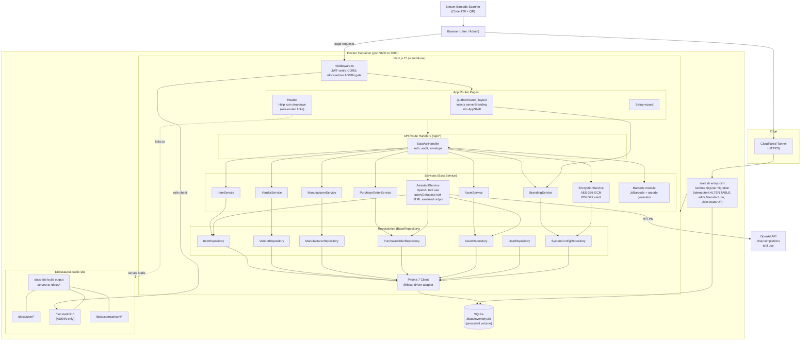
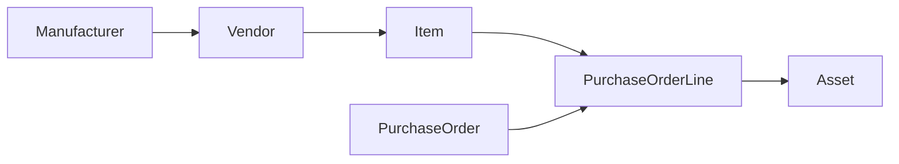

# Shane Inventory Architecture (authoritative)

This file is the source-of-truth architecture diagram for Shane Inventory. It is mirrored into the Docusaurus admin guide at `docs-site/docs/admin/architecture.md` and `docs-site/docs/admin/_architecture-diagram.md`.

## Runtime architecture

## Traceability chain

## Notes on recent changes

- Manufacturer entity added upstream of Vendor in the traceability chain.
- `User.avatarUrl` column added for profile avatars.
- Runtime SQLite migration now lives in `docker-init/start.sh` (no Prisma in the container; idempotent `ALTER TABLE`).
- Docusaurus documentation site is built into the same Docker image and served by Next.js at `/docs/*`, with `/docs/admin/*` gated by middleware to the ADMIN role only.
- Header has a Help icon dropdown that role-routes to `/docs/user`, `/docs/admin`, and `/docs/comparison`.
- Multi-tenancy has been removed; the app is single-tenant.
- `AssistantService` uses OpenAI tool use with a `queryDatabase` function and renders sanitized HTML output.
- Server-side branding injection in the authenticated layout eliminates color/logo flash on first paint.
- Encrypted `SystemConfig` vault (AES-256-GCM, PBKDF2 from a passphrase) stores the OpenAI key, SMTP credentials, and other secrets.
- Real Code 128 barcodes and QR codes are generated with `JsBarcode` and `qrcode-generator` for the Netum scanner workflow.
